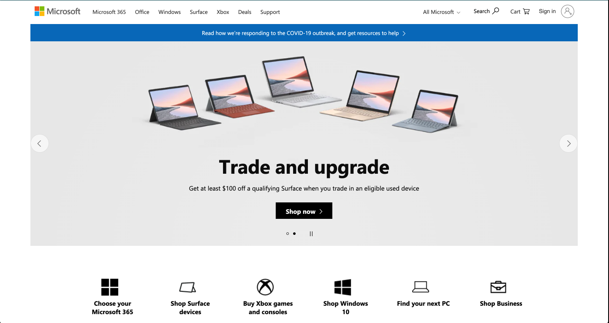

# Microsoft Mock

The goal of this is to get you confortable creating a website from a pre-existing design. Often times, when making a site, you'll start with a wireframe. If you're working in a larger company with a User Experience Designer, they're likely to deliver a design to you and you have to impliment it; this project is to get you used to this!

The intention of this deliverable is to gain practice with CSS and HTML, and you are free to use a framework (suggested: Tailwind, Bootstrap, or Materialize) or just vanilla CSS.

## Getting started

> *FORK and CLONE* this repository 

This is the Microsoft US page:

Go to the Microsoft homepage and start finding the boxes. Once you have those boxes, make your skeleton and get some content in there! If it's in a box, it'll be in a div (or sematic tag that functions like a div). 

* Take a screenshot and start drawing boxes or grab a piece of paper and draw out the website with boxes
* Create your `index.html` and start filling it with content.
* Create a `style.css`, link it up, and start playing around with how you're going to lay out your page. You can work one item at a time or start big and move into smaller, it's up to you!

### Note
* Don't worry about any cool JS stuff (like the image carosole at the start)
* As much as you can, take the images from the Microsoft website (use chrome dev tools)
* Focus on the desktop version first, don't worry about making it responsive.
* There are many different ways to go about this. If your classmate's code is drastically different from yours, that's okay! CSS is versitile and there are various methods that can be used to accomplish the same task.
* As a BONUS, make it responsive. 
